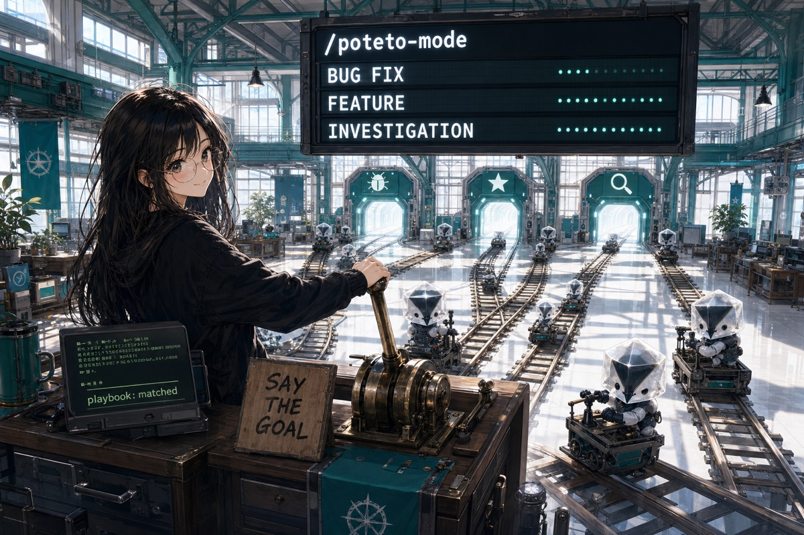
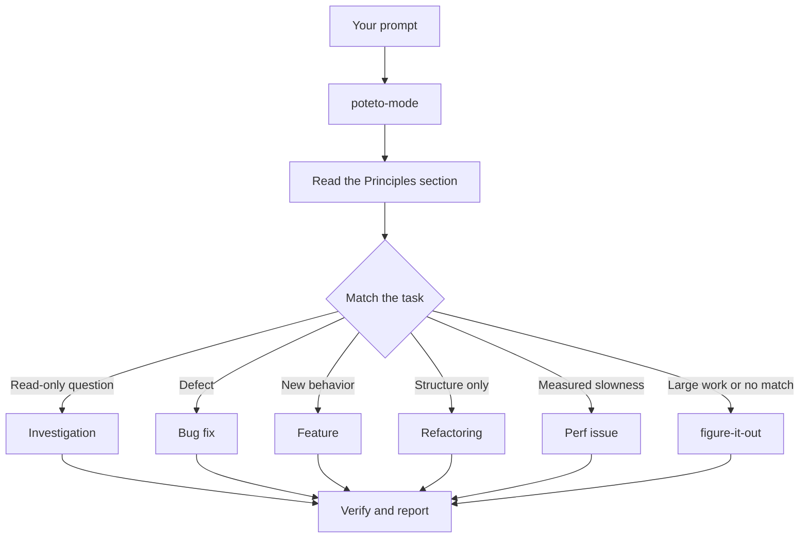

# Route work through `/poteto-mode`

`/poteto-mode` is the front door. You give it a goal, it matches one of twenty-three playbooks, copies that playbook's steps into the todo list, and calls the other skills as the steps need them. In this page you learn what a good prompt looks like, and how little of one you actually need.



## What happens to your prompt



The diagram shows the common routes. There are also playbooks for hillclimbing a metric, diagnosing runtime symptoms and captured traces, prototypes, visual parity, authoring and evaluating skills, autonomous runs, opening a PR, babysitting a PR or stack to merge-ready, shipping a verified stack, running a PR queue on autopilot (stack and full), orchestrating project-scale programs, session pickup, pausing safely, multi-phase plans, and worktree cleanup. The [playbook directory](../../skills/poteto-mode/playbooks/) has the full set.

<details>
<summary>the twenty-three playbooks</summary>

| playbook | for |
|---|---|
| [investigation](../../skills/poteto-mode/playbooks/investigation.md) | a read-only question. how does x work, why was y built this way, are we sure. |
| [bug fix](../../skills/poteto-mode/playbooks/bug-fix.md) | reproduce a defect, root-cause it, and fix with runtime evidence. |
| [perf](../../skills/poteto-mode/playbooks/perf-issue.md) | trace a measured slowness and improve it against a baseline. |
| [hillclimb](../../skills/poteto-mode/playbooks/hillclimb.md) | sustained, scientific improvement of one metric against a target, looping hypotheses with before/after measurement and one commit per accepted win. |
| [runtime forensics](../../skills/poteto-mode/playbooks/runtime-forensics.md) | diagnose a live symptom (leak, idle-cpu spin, glitch) from instrumentation. |
| [trace forensics](../../skills/poteto-mode/playbooks/trace-forensics.md) | diagnose a captured profiling artifact (cpuprofile, trace, spindump, heap snapshot). |
| [feature](../../skills/poteto-mode/playbooks/feature.md) | new or changed behavior, built from a named data shape. |
| [refactoring](../../skills/poteto-mode/playbooks/refactoring.md) | a behavior-preserving change to structure or shape. |
| [prototype](../../skills/poteto-mode/playbooks/prototype.md) | a throwaway sketch to make a design or behavioral decision cheaply, or to settle an empirical fork by observing it. |
| [visual parity](../../skills/poteto-mode/playbooks/visual-parity.md) | pixel-exact ui equivalence between two implementations. |
| [authoring a skill](../../skills/poteto-mode/playbooks/authoring-a-skill.md) | writing or editing a SKILL.md. |
| [eval](../../skills/poteto-mode/playbooks/eval.md) | test how a skill or prompt change affects agent behavior, blinded. |
| [babysit](../../skills/poteto-mode/playbooks/babysit.md) | drive a pr or a stack to merge-ready: conflicts, review threads, ci. |
| [shipping](../../skills/poteto-mode/playbooks/shipping.md) | independently verify a green stack, then land the contiguous verified run with graphite merge-when-ready. |
| [autonomous run](../../skills/poteto-mode/playbooks/autonomous-run.md) | drive a long task to completion without stopping. |
| [orchestrate](../../skills/poteto-mode/playbooks/orchestrate.md) | a standing project handed to one coordinator chat: multi-day, many stacked prs, fleets of subagents. |
| [autopilot-full](../../skills/poteto-mode/playbooks/autopilot-full.md) | run independent prs to merged with one owner per pr and root verification of each merge-ready head. |
| [autopilot-stack](../../skills/poteto-mode/playbooks/autopilot-stack.md) | build and verify one linear graphite stack for the operator to review and land. |
| [session pickup](../../skills/poteto-mode/playbooks/session-pickup.md) | resume or take over a prior agent's in-flight work. |
| [pause safely](../../skills/poteto-mode/playbooks/pause-safely.md) | suspend in-flight work cleanly so it can be resumed later. |
| [multi-phase plan](../../skills/poteto-mode/playbooks/multi-phase-plan.md) | work that spans phases or stacked PRs. |
| [worktree cleanup](../../skills/poteto-mode/playbooks/worktree-cleanup.md) | reclaim disk by pruning merged or abandoned worktrees and stale ios simulators, safety-gated. |
| [opening a pr](../../skills/poteto-mode/playbooks/opening-a-pr.md) | commits, deslopping, unslop descriptions, and PR creation. |

</details>

## Say the goal, not the ceremony

You don't write a spec. You say what's wrong or what you want, plus anything you already know that saves the agent time:

```text
/poteto-mode users get two notifications after a retry. repro first, then fix and verify.
```

That's a Bug fix prompt. "repro first" is a real constraint, not politeness, and the playbook honors it. Watch the todo list fill with the Bug fix steps. A skipped step stays visible with `skip: <reason>`.

When the conversation already carries the context, the prompt shrinks to almost nothing. All of these are enough:

```text
/poteto-mode do it
```

```text
continue
```

```text
keep going until done
```

Short works because the mode is sticky and the playbook holds the structure. Your words carry the intent, and the skill carries the rigor.

## Switch tasks with "new task"

A long chat accumulates context from the last task. When you change subjects, say so:

```text
/poteto-mode new task. figure out why the cache entry survives logout. don't change any code yet.
```

"new task" tells `/poteto-mode` to re-match rather than continue the prior playbook. "don't change any code yet" pins this one to Investigation. Without those two phrases, a mode mid-Feature tends to treat your question as the next feature step.

## Give parallel work its own worktree

If you run several agents against one repository, they will fight over the working tree. Ask for isolation up front:

```text
/poteto-mode new task. branch off <base> in a fresh worktree, then port the parser change there.
```

Each task in its own branch and worktree means no agent stomps another's files. The [Opening a PR playbook](../../skills/poteto-mode/playbooks/opening-a-pr.md) already works from a worktree for code changes, so mostly you only say this when a specific base or location matters.

Worktrees accumulate. When disk gets tight, ask:

```text
/poteto-mode what's eating my disk? prune the worktrees that are safe to prune.
```

The [Worktree cleanup playbook](../../skills/poteto-mode/playbooks/worktree-cleanup.md) classifies every worktree by merge state, uncommitted work, and which chats still touch it. It deletes only what that evidence clears and pauses for your call on anything holding uncommitted work.

## Leave it running

When you step away, say what done means and go:

```text
/poteto-mode im stepping away. keep going until the migration check reports zero old callers. log your decisions.
```

Work you'll review later routes through [`/figure-it-out`](../../skills/figure-it-out/SKILL.md), which designs the run's phases and keeps a [`/show-me-your-work`](../../skills/show-me-your-work/SKILL.md) decision log. [Run work while you sleep](./07-overnight.md) covers the full overnight contract.

## Antigravity artifacts and planning

agystack integrates with Antigravity's visual artifact system (`<appDataDir>/brain/<conversation-id>/`).

- **Planning mode.** Multi-step features and complex plans generate an `implementation_plan.md` artifact. Review the proposed architecture, components, and verification strategy in a clean side panel.
- **Walkthroughs and verification.** Completed tasks generate a `walkthrough.md` artifact detailing all changes, verification commands executed, pass receipts, and embedded media.
- **Rich reports.** In-depth investigations, architecture sketches, benchmark hillclimbs, and runtime forensics write dedicated `.md` artifacts with Mermaid diagrams, Carousels, and LaTeX math.
- **Unslopped chat.** Instead of dumping walls of markdown in chat, `/poteto-mode` keeps chat replies terse, high-signal, and linked directly to the generated artifacts.

Read [`poteto-mode`](../../skills/poteto-mode/SKILL.md) itself for the full routing rules.

Next: [Understand the code](./03-understand.md).
